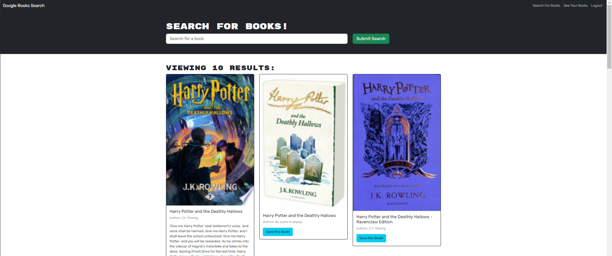

# Boot-Search-Engine

## Description
This project, a coding challenge for a Fullstack Flex Bootcamp, transforms a fully functioning Google Books API search engine built with a RESTful API into a GraphQL API built with Apollo Server. The app was refactored to use Apollo Server at its core, enabling efficient fetching of data and improved query performance. This demonstrates the power and flexibility of GraphQL in handling API requests and responses.

## Table of Content
  * [Description](#description)
  * [Technologies](#technologies)
  * [Installation](#installation)
  * [License](#license)
  * [Resources](#resources)
  * [Deployment](#deployment)
  * [Questions](#questions)
  * [Contact](#contact)

## Technologies
This project utilizes several key technologies:

Node.js and Express.js: For building the backend server and API.
MongoDB and Mongoose ODM: For the database to store user and book data.
GraphQL: A query language for APIs, used for efficient data retrieval.
Apollo Server: An open-source, spec-compliant GraphQL server that works with any GraphQL schema.
React: A JavaScript library for building user interfaces.
JWT (JSON Web Tokens): For secure user authentication.
Heroku: For hosting the deployed application.

## Installation
To set up the project locally, follow these steps:

Clone the repository to your local machine.
Run npm install in the root directory to install required dependencies.
Ensure MongoDB is installed and running on your machine.
Use npm run develop to start both the server and client concurrently.
Access the application on localhost:3000.

## License
